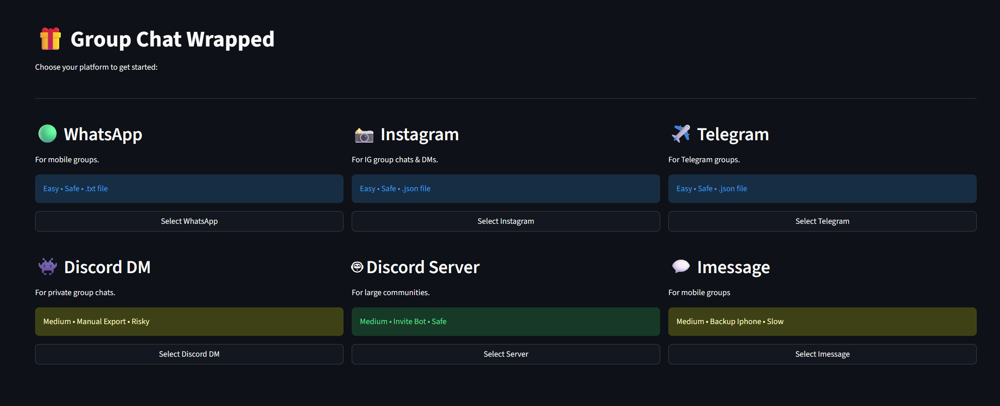
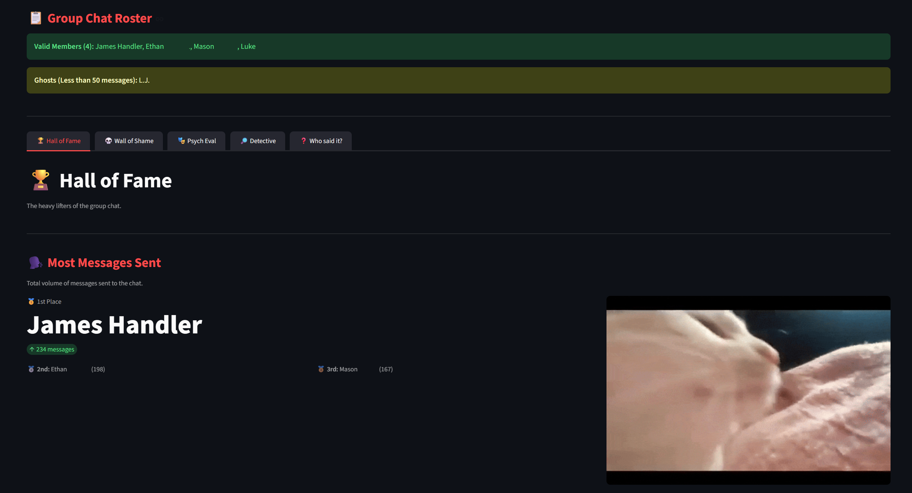
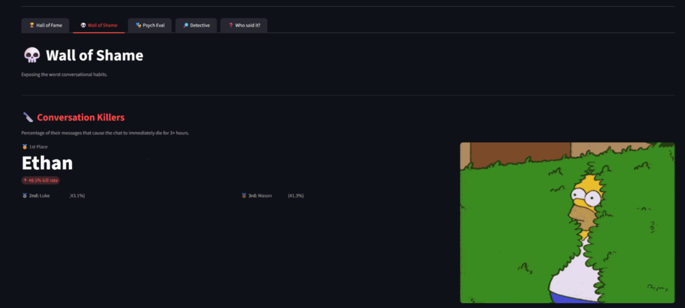
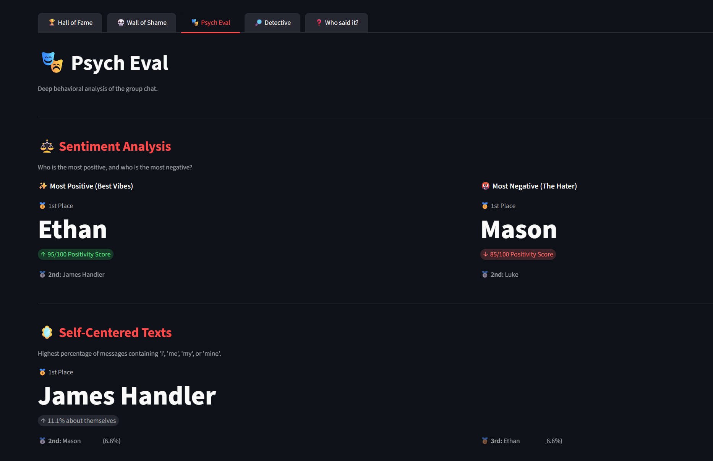
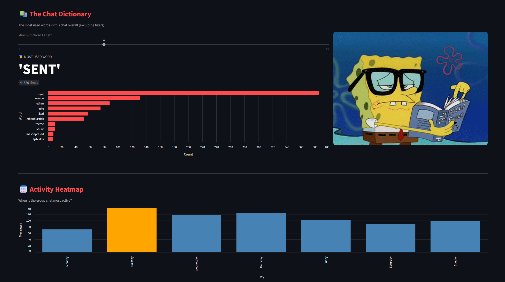
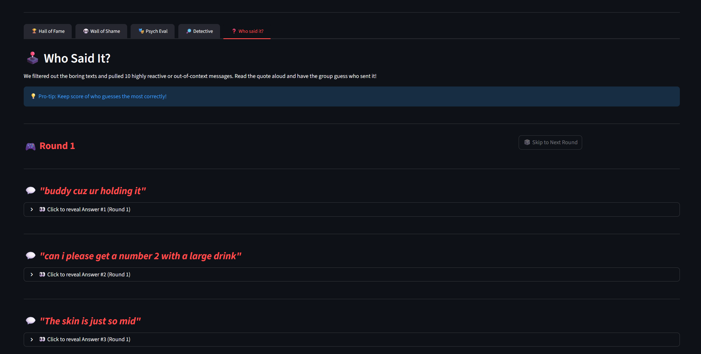

# 🎁 Group Chat Wrapped

Welcome to **Group Chat Wrapped**! This is a local Streamlit web application that takes your exported group chat data and turns it into a fun, interactive "Spotify Wrapped" style dashboard. 

Ever wondered who carries the conversation, who kills it, or who has the most positive vibes? This app analyzes your chat history to give you the ultimate group chat awards.

## ✨ Features

The app breaks down your chat into five hilarious and insightful categories:

### 🏆 Hall of Fame
Discover who sends the most messages, gets the highest reaction rates, and revives dead conversations.

### 💀 Wall of Shame
Exposing the worst habits—find out who the biggest "Conversation Killers," ghosts, and double-texters are.

### 🎭 Psych Eval
Deep behavioral analysis including Sentiment Analysis (who is the most positive vs. negative), ego-checks, and one-word reply ratios.

### 🔎 Detective
Search the chat history for specific words, view the most-used words dictionary, and check out the activity heatmap.

### ❓ Who Said It?
An interactive party game! The app pulls highly reactive or out-of-context messages for your group to read aloud and guess who sent them.

## 📱 Supported Platforms

The app includes built-in parsers and instructions for:
* **WhatsApp** (`.txt` exports)
* **Instagram DMs** (`.json` exports)
* **Telegram** (`.json` exports)
* **Discord DMs** (via DiscordChatExporter)
* **Discord Servers** (includes a downloadable `bot_dumper.py` script for safe extraction)
* **iMessage** (requires local iPhone backup and included `imessage_dumper.py` script)

## 🛠️ Installation & Setup

Because this app processes your private chat data, it is designed to be run **locally** on your own machine. Your data is never uploaded to an external server.

**1. Clone the repository**
`git clone [https://github.com/YOUR-USERNAME/YOUR-REPO-NAME.git](https://github.com/YOUR-USERNAME/YOUR-REPO-NAME.git)`

**2. Install dependencies**
Make sure you have Python installed, then run:
`pip install -r requirements.txt`

**3. Run the app**
`streamlit run app.py`

The app will automatically open in your default browser.

**🔒 Privacy & Security**
All data parsing and sentiment analysis (using NLTK) happens locally on your machine. The app does not store your messages or send them to any external databases.